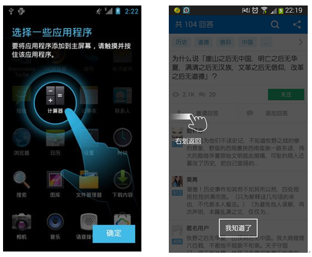
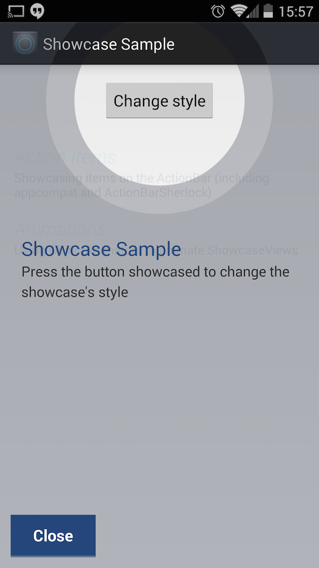
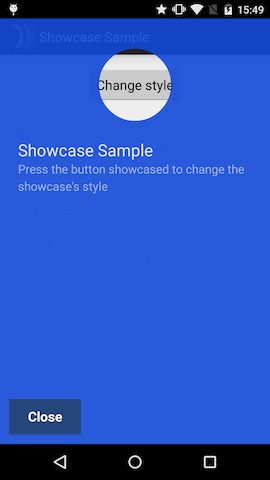
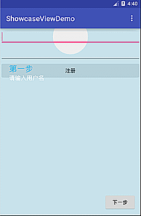

* 欢迎关注微信公众号、长期为您推荐优秀博文、开源项目、视频

* 微信公众号名称：Android干货程序员

* 

* 项目总贴:https://github.com/open-android/Android
---
在安卓系统第一次使用的时候，我们会看到类似如下左图的界面，它用一个半透明的图片遮盖住下面的界面，而突出界面中的某一个按钮或者图标，然后在旁边写上若干提示文字，告诉用户某个操作方法。类似的，当我们第一次使用某些软件的时候，也会出现一个半透明的提示界面，比如知乎在第一次查看的时候，会告诉你右划返回，当你以后再进行相同的操作时，这个半透明的提示图片就不会出现了。



| Holo | "New style" | Material |
| --- | --- | --- |
|  |  |  |


## 使用步骤
### 1. 在Module的build.gradle添加依赖

~~~
compile 'com.github.amlcurran.showcaseview:library:5.4.3'
~~~

### 2. 假设在Activity中有一个按钮，你想突出它(如上面三张图片)，在Activity的onCreate()方法中添加如下代码：
```java
 Button get_src_bn = (Button)findViewById(R.id.get_source_bn);

 new ShowcaseView.Builder(this)
         .setTarget(new ViewTarget(get_src_bn))//设置button为突出的目标
         .setContentTitle("我的微信公众号")
         .setContentText("Android干货程序员")
         .hideOnTouchOutside()
         .build();
```
这就是使用ShowcaseView的默认方法，很简单吧，你想突出什么，就以什么为Target。

### 3. 在Activity中，你不想突出任何一个按钮或者View，你只是想像第一张图片一样显示一个半透明图片告诉用户某种手势操作，那么你的代码应该是这样的：
```java
 ShowcaseView showcaseView = new ShowcaseView.Builder(this)
                             .setStyle(R.style.Custom_semi_transparent_demo)//setStyle instead of setTarget!
                             .hideOnTouchOutside()
                             .build();
 ```
你没有target任何一个view，而是使用了setStyle来手动的设置一个背景主题，那么这个背景主题就是关键了，Custom_semi_transparent_demo的代码如下：
```java
 <style name="Custom_semi_transparent_demo" parent="ShowcaseView.Light">
     <item name="sv_backgroundColor">#663d4353</item>
     <item name="sv_showcaseColor">#25467A</item>
     <item name="sv_buttonText">Close</item>
 </style>
 ```                            
可以看到这个背景主题是继承了ShowcaseView.Light主题，然后修改了背景颜色、字体颜色和按钮文字。设置完正确的style之后，还需要马上设置背景图片，这个例子中的背景图片是R.drawable.swipe_back_en，图片必须是png格式的透明图片。

### 4. 在Activity中，想实现用户注册引导界面，如下图，代码如下：


```java
<?xml version="1.0" encoding="utf-8"?>
<LinearLayout xmlns:android="http://schemas.android.com/apk/res/android"
    xmlns:tools="http://schemas.android.com/tools"
    android:orientation="vertical"
    android:layout_width="match_parent"
    android:layout_height="match_parent"
    tools:context="com.lavor.showcaseviewdemo.MainActivity">

    <EditText
        android:id="@+id/username"
        android:layout_width="match_parent"
        android:layout_height="wrap_content" />
    <EditText
        android:id="@+id/password"
        android:inputType="textPassword"
        android:layout_width="match_parent"
        android:layout_height="wrap_content" />
    <Button
        android:id="@+id/register"
        android:text="注册"
        android:layout_width="match_parent"
        android:layout_height="wrap_content" />
</LinearLayout>
 ```   
 ```java
  /**
     * 简单的用户注册引导
     */
    public  void registerGuide(){
        this.register = (Button) findViewById(R.id.register);
        this.password = (EditText) findViewById(R.id.password);
        this.username = (EditText) findViewById(R.id.username);
        usernameTarget = new ViewTarget(username);
        passwordTarget = new ViewTarget(password);
        registerTarget = new ViewTarget(register);
        final Button usernameButton=new Button(this);
        usernameButton.setText("下一步");
        final Button passwordButton=new Button(this);
        passwordButton.setText("下一步");
        final Button registerButton=new Button(this);
        registerButton.setText("明白了");
        usernameShowcaseView=new ShowcaseView.Builder(this)
                .withHoloShowcase()
                .setTarget(usernameTarget)
                .setContentTitle("第一步")
                .setContentText("请输入用户名")
                .replaceEndButton(usernameButton)
                .build();
        passwordShowcaseView=new ShowcaseView.Builder(MainActivity.this)
                .withHoloShowcase()
                .setTarget(passwordTarget)
                .setContentTitle("第二步")
                .setContentText("请输入密码")
                .replaceEndButton(passwordButton)
                .build();
        passwordShowcaseView.hide();
        registerShowcaseView=new ShowcaseView.Builder(MainActivity.this)
                .withHoloShowcase()
                .setTarget(registerTarget)
                .setContentTitle("第三步")
                .setContentText("请点击注册按钮")
                .replaceEndButton(registerButton)
                .build();
        registerShowcaseView.hide();
        usernameButton.setOnClickListener(new View.OnClickListener() {
            @Override
            public void onClick(View v) {
                usernameShowcaseView.hide();
                passwordShowcaseView.show();
            }
        });
        passwordButton.setOnClickListener(new View.OnClickListener() {
            @Override
            public void onClick(View v) {
                passwordShowcaseView.hide();
                registerShowcaseView.show();
            }
        });
        registerButton.setOnClickListener(new View.OnClickListener() {
            @Override
            public void onClick(View v) {
                registerShowcaseView.hide();
            }
        });
    }
 ```       
